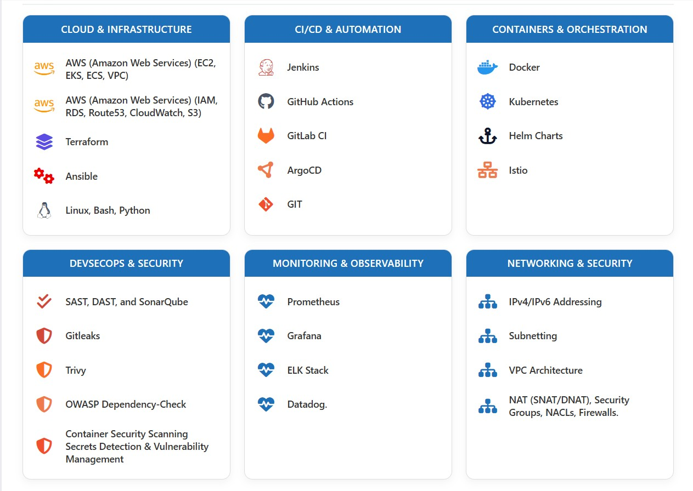

# 💫 About Me:

Seasoned Lead DevOps Engineer with 16+ years of technical expertise   
Expereince in delivering DevOps solutions across BFSI, Telecom, Storage, and 
Virtualization domains.  
Highly skilled, Deep Hands-on in AWS Cloud, Terraform, Docker,   Kubernetes,Ansible, automation, CI/CD, cost optimization.

# 💻 Tech Stack:

 <title>DevOps Portfolio Projects</title>
</head>

<body>

<h1>🚀 DevOps Portfolio Projects</h1>

<table>
<tr>
    <th width="15%">Category</th>
    <th width="25%">Project</th>
    <th width="40%">Description</th>
    <th width="20%">Technologies</th>
</tr>

<!-- GitLab -->
<tr class="category">
    <td colspan="4">GitLab CI/CD</td>
</tr>

<tr>
    <td>GitLab CI/CD</td>
    <td>
        <a href="https://gitlab.com/nanuchi/gitlab-cicd-crash-course" target="_blank">
        GitLab CI/CD Crash Course
        </a>
    </td>
    <td>
        End-to-end GitLab CI/CD implementation demonstrating pipelines,
        stages, artifacts, Docker image builds, testing and deployments.
    </td>
    <td>
        GitLab
        Docker
        CI/CD
    </td>
</tr>

<tr>
    <td>GitLab CI/CD</td>
    <td>
        <a href="https://gitlab.com/goldedeepak11/gitlab-cicd-demo" target="_blank">
        GitLab CI/CD Demo
        </a>
    </td>
    <td>
        Demonstrates automated build, test and deployment workflows
        using GitLab pipelines.
    </td>
    <td>
        GitLab
        Docker
        Pipeline
    </td>
</tr>

<tr>
    <td>GitLab CI/CD</td>
    <td>
        <a href="https://gitlab.com/goldedeepak11/gitlab-demo-python" target="_blank">
        Python CI/CD Demo
        </a>
    </td>
    <td>
        Python application integrated with GitLab pipeline for automated
        testing and deployment.
    </td>
    <td>
        Python
        GitLab
        CI/CD
    </td>
</tr>

<tr>
    <td>GitLab CI/CD</td>
    <td>
        <a href="https://gitlab.com/goldedeepak11/gitlab-demo" target="_blank">
        GitLab Demo
        </a>
    </td>
    <td>
        Basic GitLab repository demonstrating source control,
        branching and CI/CD workflow integration.
    </td>
    <td>
        GitLab
        Git
    </td>
</tr>

<!-- GitHub Actions -->
<tr class="category">
    <td colspan="4">GitHub Actions</td>
</tr>

<tr>
    <td>GitHub Actions</td>
    <td>Enterprise CI/CD Pipeline</td>
    <td>
        Multi-stage CI/CD pipeline implementing build, test,
        Docker image creation, security scanning and deployment.
    </td>
    <td>
        GitHub Actions
        Docker
        CI/CD
    </td>
</tr>

<!-- ArgoCD -->
<tr class="category">
    <td colspan="4">ArgoCD</td>
</tr>

<tr>
    <td>ArgoCD</td>
    <td>GitOps Deployment Platform</td>
    <td>
        Kubernetes GitOps deployment using ArgoCD with automated
        synchronization and rollback capabilities.
    </td>
    <td>
        ArgoCD
        GitOps
        Kubernetes
    </td>
</tr>

<!-- DevSecOps -->
<tr class="category">
    <td colspan="4">DevSecOps</td>
</tr>

<tr>
    <td>DevSecOps</td>
    <td>Shift-Left Security Pipeline</td>
    <td>
        Integrated SonarQube, Trivy, Gitleaks and OWASP Dependency Check
        into CI/CD pipelines for automated vulnerability detection.
    </td>
    <td>
        SonarQube
        Trivy
        Gitleaks
        OWASP
    </td>
</tr>

<!-- AWS -->
<tr class="category">
    <td colspan="4">AWS</td>
</tr>

<tr>
    <td>AWS</td>
    <td>AWS Infrastructure Automation</td>
    <td>
        Provisioning highly available cloud infrastructure using
        Infrastructure as Code principles.
    </td>
    <td>
        AWS
        EC2
        VPC
        RDS
        S3
    </td>
</tr>

<!-- Terraform -->
<tr class="category">
    <td colspan="4">Terraform</td>
</tr>

<tr>
    <td>Terraform</td>
    <td>Infrastructure as Code Framework</td>
    <td>
        Automated provisioning of AWS resources including EKS,
        VPCs, Load Balancers and Security Groups.
    </td>
    <td>
        Terraform
        AWS
        IaC
    </td>
</tr>

<!-- Kubernetes -->
<tr class="category">
    <td colspan="4">Kubernetes</td>
</tr>

<tr>
    <td>Kubernetes</td>
    <td>Production EKS Platform</td>
    <td>
        Container orchestration platform implementing Helm,
        Ingress Controllers, Monitoring and GitOps deployment.
    </td>
    <td>
        Kubernetes
        EKS
        Helm
        Istio
    </td>
</tr>

</table> 
  
# WORK HISTORY:

 
<!-- Proudly created with GPRM ( https://gprm.itsvg.in ) -->
 <h2> 🔑 KEY DIFFERENTIATORS  </h2>
&nbsp;&nbsp;&nbsp;&nbsp;&nbsp; &#9632;Exceptional Technical Proficiency & Debugging Mastery  
&nbsp;&nbsp;&nbsp;&nbsp;&nbsp; &#9632; Rapid Concept-to-Execution Cycle  
&nbsp;&nbsp;&nbsp;&nbsp;&nbsp; &#9632; Proven AWS Cloud Cost Optimization Specialist  
&nbsp;&nbsp;&nbsp;&nbsp;&nbsp; &#9632; Ability To Drive Technical Transformation For Service, Cost Benefits  
&nbsp;&nbsp;&nbsp;&nbsp;&nbsp; &#9632; Business-Focused Technical Engineer  
&nbsp;&nbsp;&nbsp;&nbsp;&nbsp; &#9632; Security-First Mindset  
&nbsp;&nbsp;&nbsp;&nbsp;&nbsp; &#9632; Knowledge Multiplier   
 <h2> 💻 Technical Skills </h2>  
<h3> Dev Ops Tools (10 Years)</h3> 

    
  Terraform (5 Years) 

Deep practical expertise in designing and implementing scalable, secure, and production-grade infrastructure across AWS-cloud environments using
Terraform and its native Configuration Language (HCL)   
  
Have in-depth knowledge and practical hands-on on given below topics: </b>  
&nbsp;&nbsp;&nbsp;&nbsp;&nbsp; &#9733; Providers  
&nbsp;&nbsp;&nbsp;&nbsp;&nbsp; &#9733; Resources   
&nbsp;&nbsp;&nbsp;&nbsp;&nbsp; &#9733; Data Sources   
&nbsp;&nbsp;&nbsp;&nbsp;&nbsp; &#9733; Variables (Input Variables)   
&nbsp;&nbsp;&nbsp;&nbsp;&nbsp; &#9733; Outputs   
&nbsp;&nbsp;&nbsp;&nbsp;&nbsp; &#9733; Modules   
&nbsp;&nbsp;&nbsp;&nbsp;&nbsp; &#9733; Backend Configuration, State File, Local Backend, and Remote Backend   
&nbsp;&nbsp;&nbsp;&nbsp;&nbsp; &#9733; Terraform Workflow (Init, Plan, Apply, Destroy)   
&nbsp;&nbsp;&nbsp;&nbsp;&nbsp; &#9733; Meta-Arguments (e.g., count, for_each, depends_on, lifecycle)   
&nbsp;&nbsp;&nbsp;&nbsp;&nbsp; &#9733; State Locking  
&nbsp;&nbsp;&nbsp;&nbsp;&nbsp; &#9733; Provisioners  
&nbsp;&nbsp;&nbsp;&nbsp;&nbsp; &#9733; Workspaces  
&nbsp;&nbsp;&nbsp;&nbsp;&nbsp; &#9733; State Manipulation (terraform import, terraform state mv)   
&nbsp;&nbsp;&nbsp;&nbsp;&nbsp; &#9733; Dependencies   
&nbsp;&nbsp;&nbsp;&nbsp;&nbsp; &#9733; Drift Detection  
&nbsp;&nbsp;&nbsp;&nbsp;&nbsp; &#9733; Taint/ Untaint  
                 
<h3> AWS Cloud (5 Years) </h3> 
<b>Proficient in key AWS services used to design and implement scalable, high-availability cloud architectures: </b> 
<b>•	Compute & Scaling: </b>  
&nbsp;&nbsp;&nbsp;&nbsp;&nbsp;<b>	Amazon EC2 – </b>for flexible virtual server provisioning  
&nbsp;&nbsp;&nbsp;&nbsp;&nbsp;<b>	AWS Lambda – </b>for serverless compute and event-driven execution  
&nbsp;&nbsp;&nbsp;&nbsp;&nbsp;<b>	AWS Elastic Beanstalk – </b>for simplified application deployment and management  
&nbsp;&nbsp;&nbsp;&nbsp;&nbsp;<b>	Auto Scaling – </b>for dynamic scaling based on traffic and usage  
 
<b>•	Storage & Backup Solutions: </b>
<h2>Types of Storage Classes in AWS S3 </h2>  
&nbsp;&nbsp;&nbsp;&nbsp;&nbsp; <b> Standard:</b> Provides high durability, availability, and performance for frequently accessed data.   
&nbsp;&nbsp;&nbsp;&nbsp;&nbsp; <b> Intelligent-Tiering:</b> Automatically moves objects between two access tiers based on changing access patterns.   
&nbsp;&nbsp;&nbsp;&nbsp;&nbsp; <b> Standard-IA (Infrequent Access):</b> For data that is accessed less frequently but requires rapid access when needed.   
&nbsp;&nbsp;&nbsp;&nbsp;&nbsp; <b> One Zone-IA:</b> Lower-cost option for infrequently accessed data that doesn't require multiple Availability Zone resilience.   
&nbsp;&nbsp;&nbsp;&nbsp;&nbsp; <b> Glacier and Glacier Deep Archive: </b> For archival data with retrieval times ranging from minutes to hours.   
 
<b> •	Networking & Content Delivery: </b>  
&nbsp;&nbsp;&nbsp;&nbsp;&nbsp;<b>	Amazon VPC – </b>for creating isolated cloud networks  
&nbsp;&nbsp;&nbsp;&nbsp;&nbsp;<b>	Subnet Management –</b> including public and private subnets for secure resource segmentation  
&nbsp;&nbsp;&nbsp;&nbsp;&nbsp;<b>	Internet Gateway & NAT Gateway – </b>for controlling internet access for resources  
&nbsp;&nbsp;&nbsp;&nbsp;&nbsp;<b>	Route Tables – </b>for managing custom routing configurations  
&nbsp;&nbsp;&nbsp;&nbsp;&nbsp;<b>	Amazon Route 53 – </b>for scalable DNS and domain name management  
&nbsp;&nbsp;&nbsp;&nbsp;&nbsp;<b>	Amazon CloudFront – </b>for content delivery and caching  
&nbsp;&nbsp;&nbsp;&nbsp;&nbsp;<b>	Amazon API Gateway – </b>for building, deploying, and managing APIs at scale  
&nbsp;&nbsp;&nbsp;&nbsp;&nbsp;<b>	AWS WAF: </b>Web application protection using managed/custom rules; security against OWASP Top 10 threats.  
&nbsp;&nbsp;&nbsp;&nbsp;&nbsp;<b>	AWS ACM: </b>Automated provisioning and renewal of SSL/TLS certificates for secure AWS resource endpoints.  
&nbsp;&nbsp;&nbsp;&nbsp;&nbsp;<b>	AWS VPC Peering:</b>  
&nbsp;&nbsp;&nbsp;&nbsp;&nbsp;<b>	AWS Transit Gateway (TGW):</b>  
&nbsp;&nbsp;&nbsp;&nbsp;&nbsp;<b>	AWS VPC Endpoint:</b>  
 
<b>•	Load Balancer:</b> 
&nbsp;&nbsp;&nbsp;&nbsp;&nbsp;	Application Load Balancer (ALB):  
&nbsp;&nbsp;&nbsp;&nbsp;&nbsp;	Network Load Balancer (NLB):  
&nbsp;&nbsp;&nbsp;&nbsp;&nbsp;	Gateway Load Balancer (GWLB):	 
 
<b>•	Security & Identity Management:</b> 
&nbsp;&nbsp;&nbsp;&nbsp;&nbsp;	AWS Identity and Access Management (IAM):  
&nbsp;&nbsp;&nbsp;&nbsp;&nbsp;	AWS Secrets Manager:  
&nbsp;&nbsp;&nbsp;&nbsp;&nbsp;	AWS Key Management Service (KMS): 
&nbsp;&nbsp;&nbsp;&nbsp;&nbsp;	AWS Control Tower, Organizations  
 
<b>•	Storage & Backup Solutions: </b> 
 
<b>•	Database & Caching: </b> 
&nbsp;&nbsp;&nbsp;&nbsp;&nbsp;	RDS  
&nbsp;&nbsp;&nbsp;&nbsp;&nbsp;	DYANMO DB  
&nbsp;&nbsp;&nbsp;&nbsp;&nbsp;	Elastic Cache  
&nbsp;&nbsp;&nbsp;&nbsp;&nbsp;	Aurora  
 
<b>•	CI/CD & DevOps Tooling:</b>   
 
<b>•	Containers & Orchestration:</b>   
 
<b>•	Monitoring & Logging:</b>  
  •	Experienced in identifying and managing end-of-life (EOL) AWS services, ensuring seamless migration to supported alternatives and maintaining compliance with best practices.  
•	Implemented and maintained AWS cost optimization strategies to improve cloud resource efficiency and reduce operational expenses, including:  

<h3>Kubernetes (5 Years) </h3> 
<h3> Docker (5 Years) </h3> 
<h3> Jenkins CI-CD, GIT (8 Years) </h3>  
<h3> Ansible (5 Years) </h3> 
<h3> Python (8 Years) </h3> 
</html>

<h3> Helm, Helm Charts GitOps, Argo CD, GitLab CI </h3>  
<h3> Linux, Shell Scripting (16 Years) </h3> 
/>

